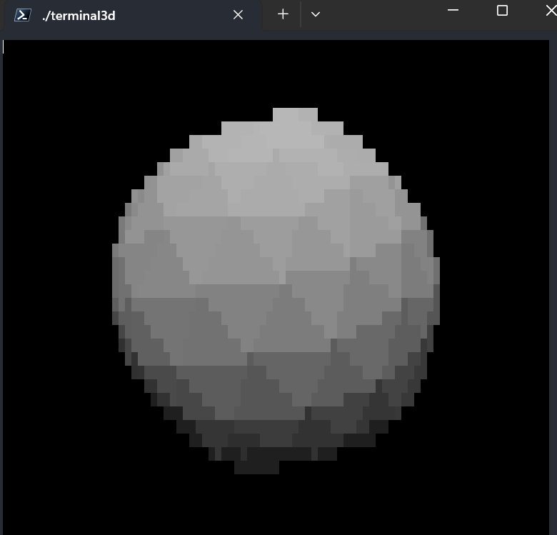

# terminal-3d

A hobby project to create a fairly decent realtime 3D renderer in the terminal. A few goals:

1. All C source code is mine (or contributed by others). This means no libraries like curses or OpenGL.
    - This is one of the main reasons the display medium is a terminal - windows are hecking complicated.
2. Just because the output method is slow, doesn't mean the underlying renderer should or can be.
3. Portability isn't too important, though it is nice.
    - This means all code is written to work on GNU/Linux, and *likely* works on Mac too.
    - No consideration for Windows whatsoever. If you're on Windows, use Docker or WSL.

## Demo Image

Icosphere rendered with Terminal 3D using the Phong shading model (see below).

## Features

- Framerate limiting
- Monospace correction (because terminals typically do not have a 1:1 character aspect ratio)
- Configurable rendering settings, including clipping planes and FOV
- Configurable initial position, scale, and rotation
- Super simple animation in rotation
- Optional double buffering (which enables [optimized screen writes](#optimized-screen-writes))
- Configurable rendering styles, including:
    - Wireframe
    - Toggleable backface culling (only when wireframe is disabled)
    - Selectable [shading method](#shading-methods)

### Optimized Screen Writes

When double buffering is enabled, Terminal-3d leverages the secondary buffer to keep track of changes between frames. This allows it to only update pixels that have changed, instead of re-drawing every pixel on every frame.

### Shading Methods

#### Indexed (`SM_INDEXED`)

This shading mode colors each triangle proportional to its index in the source model. Brighter = higher index. To prevent the first few triangles from being virtually invisble, the `INDEX_AMBIENT_LIGHT` setting is added to the final brightness of each face.

#### Normal (`SM_NORMAL`)

This shading mode colors each triangle using its flipped normal. Flipped, cuz normals facing the camera are mostly negative. Which means they're usually black or a single channel.

#### Phong (`SM_PHONG_SHADING`)

This shading mode uses the diffuse portion of the [Phong Reflection Model](https://en.wikipedia.org/wiki/Phong_reflection_model) at the triangle level. Each triangle's brightness is set according to the dot product between a configrable global directional light direction and the surface normal.

Maximum brightness due to diffuse Phong reflections and an ambient light level are configurable with `PHONG_STRENGTH` and `PHONG_AMBIENT_LIGHT` respectively.

## Build & Run

Build: `make all` in project root. The generated executable is `terminal3d`.

Run: `terminal3d <width> <height>`. For example, `terminal3d 64 32` to render 64x32 images to the terminal. Recommended call pattern: `terminal3d $(tput cols) $(tput lines)`.
  - If your terminal's width differs from `<width>`, then the output will be messy. I don't mess with newlines in my rendering (maybe in the future).

**Press `Q` to exit**.

Currently all configuration (other than display resolution) is defined in `src/Config.h`. Its a lazy-man's config file.

## Architecture Notes

Core engine code (eg. perspective rendering, drawing to the screen, etc.) is abstracted into a library in `lib/Engine`. Similarly, logging code is powered by a simple, custom, logging library in `lib/Logger`.

Each library has its own `makefile` to generate an archive of object files for compilation. Corresponding header files are provided to include in your own code. Example: `lib/Engine/Engine.h` is the public interface of `lib/Engine`, with an object file archive named `lib/Engine/Engine.a` generated by `lib/Engine/Makefile`.

## System Requirements

Not very formal, but you can expect the program to run on a system that meets the following:

- ANSI-compatible terminal
- Definitely GNU/Linux, but probably any mostly-POSIX-compliant OS (such as Mac)
